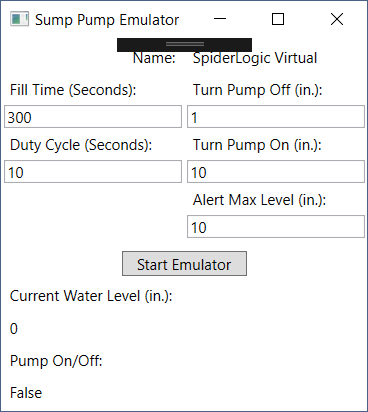

# Sump Pump Emulator
This WPF Program is used to simulate the data, events, and test the different workflows that will be used by the Edison IoT program. It is a simple one screen application written in WPF.



## Properties
### Changeable Properties
**Fill Time:** The amount of time in seconds that it will take for the Virtual Sump Pump to fill with water  
**Duty Cycle:** The amount of time in seconds that it will take for the Virtual Sump Pump to empty the water  
**Turn Pump Off:** The water level in inches when the virtual sump pump will turn off  
**Turn Pump On:** The water level in inches when the virtual sump pump will turn on  
**Alert Max Level:** Not Implemented Yet - The water level in inches when the monitor will send an alert message that the water level is too high  

### Read Only Properties
**Name:** Sump Pump Name that has been set by the Portal  
**Current Water Level:** Water level in inches that is recorded when the emulator is running  
**Pump On/Off:** Status of the sump pump when the emulator is running  

### Commands
**Start Emulator:** Press this button to start the emulator, and begin to transmit data to the Configured IoT Hub  

## Configuration File Settings
The application uses [Slow Cheetah](https://github.com/Microsoft/slow-cheetah/), so that seperate .Debug.config and .Release.config files can be created. The important settings are listed below:
``` xml
  <appSettings>
    <add key="HostName" value="" />
    <add key="SharedAccessKeyName" value="" />
    <add key="SharedAccessKey" value="" />
  </appSettings>
```
**HostName:** The hostname of the IoT Hub (without https://)  
**SharedAccessKeyName:** Probably iothubowner  
**SharedAccessKey:** Primary Key for the key name listed previously  